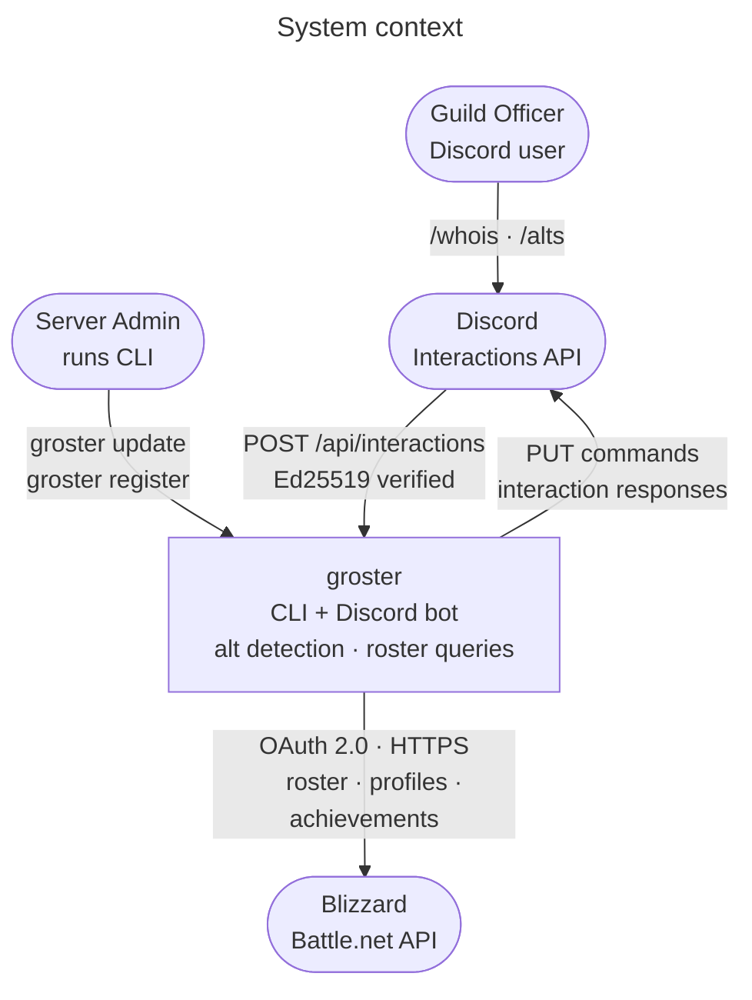
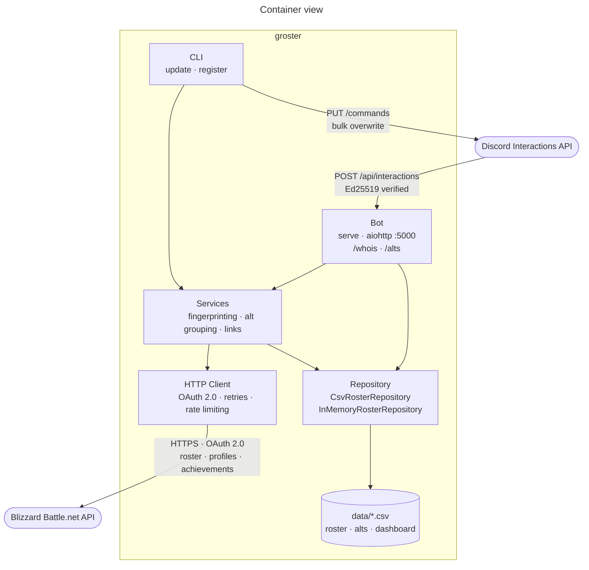

# Architecture

groster fetches a WoW guild roster from the Blizzard Battle.net API, identifies which characters belong to the same player through achievement fingerprinting, and exposes the results via CSV files and Discord slash commands (`/whois`, `/alts`).

## System context



## Container view



Three commands share the same service and repository layers:

- **`groster update`** — batch CLI that fetches the full roster, computes alt groups, writes CSVs.
- **`groster serve`** — long-running aiohttp server that answers Discord `/whois` and `/alts` by reading the CSVs.
- **`groster register`** — one-shot call to bulk-register all slash commands with the Discord API.

## Module Map

```
groster/
├── cli.py               Click entrypoint, subcommands: update, serve, register
├── constants.py          Thresholds, achievement IDs, region set, user-agent
├── models.py             PlayableClass / PlayableRace TypedDicts, row→dict factory
├── ranks.py              Guild rank namedtuples, immutable default mapping
├── utils.py              data_path(), format_timestamp()
├── logging.py            One-call logging setup (text or structured JSON)
├── http_client.py        BlizzardAPIClient — OAuth, retries, rate limiting
├── services.py           Fingerprinting, alt grouping, profile link building
├── commands/
│   ├── roster.py         update_roster() orchestrator, dashboard generation
│   ├── bot.py            aiohttp handler for Discord interactions
│   └── discord.py        Slash command registration
└── repository/
    ├── base.py           RosterRepository ABC (18 abstract async methods)
    ├── csv.py            CsvRosterRepository — pandas-backed file I/O
    └── memory.py         InMemoryRosterRepository — dict-backed, for testing
```

Dependencies flow strictly downward: `cli → commands → services/repository → http_client → constants/models`. No cycles.

## Data Flow: Roster Update

`groster update --region eu --realm terokkar --guild darq-side-of-the-moon`

```
1. Authenticate          OAuth 2.0 client credentials → bearer token (in-memory, 60s refresh buffer)
2. Fetch static data     playable-class/index, playable-race/index → classes.csv, races.csv
3. Resolve ranks         Load from CSV or fall back to hardcoded defaults → {region}-{realm}-{guild}-ranks.csv
4. Fetch roster          GET guild/{realm}/{guild}/roster → member list
5. Fetch profiles        50-concurrent semaphore, 10ms inter-request delay, 1s inter-batch pause
                         → {region}-{realm}-{guild}-roster.csv + per-character profile.json
6. Build profile links   raider.io / armory / warcraftlogs URLs → {region}-{realm}-{guild}-links.csv
7. Identify alts         Fingerprint + group (see below) → {region}-{realm}-{guild}-alts.csv
                         Also saves pets.json, mounts.json per character and achievements summary CSV
8. Generate dashboard    pandas merge of roster + links + alts + achievements + static mappings
                         → {region}-{realm}-{guild}-dashboard.csv
```

All writes go through the `RosterRepository` abstraction (`CsvRosterRepository` in production). The dashboard is the denormalized union of every other CSV, used by the bot for `/whois` lookups.

## Alt Detection

The core algorithm lives in `services.py`. It answers: _which characters belong to the same Battle.net account?_

### Insight

Blizzard shares certain achievements account-wide. Two characters on the same account complete the same achievements at the exact same millisecond timestamp. Different accounts almost never share identical `(achievement_id, timestamp)` pairs.

### Fingerprinting

For each character, fetch achievements and extract the 13 "Fashionista" achievements plus "Toying Around" (IDs in `FINGERPRINT_ACHIEVEMENT_IDS`). Build a fingerprint:

```python
fingerprint = sorted tuple of (achievement_id, completed_timestamp)
```

Only achievements with a non-null timestamp and >= 3 entries are considered reliable.

### Grouping

Pairwise Jaccard similarity over fingerprint sets:

```
similarity = |A ∩ B| / |A ∪ B|
```

Threshold: **0.8** (`ALT_SIMILARITY_THRESHOLD`). Characters above the threshold are grouped. The algorithm is greedy: pick a base character, pull all matches into its group, repeat with the remaining pool.

### Main Detection

Within each group, the character with the earliest "Level 10" achievement timestamp (`LEVEL_10_ACHIEVEMENT_ID = 6`) is designated the main. Fallback: first character in the group.

### Output

Each character gets a row in the alts CSV:

| id  | name     | alt   | main   |
| --- | -------- | ----- | ------ |
| 123 | Thrall   | False | Thrall |
| 456 | Grommash | True  | Thrall |

## Guild Membership Changes and Alt Groupings

The alt-detection algorithm is stateless: it only sees the characters currently
in the guild. This is intentional — the system cannot query the Blizzard API
for players who have already left. As a result, guild membership churn
produces predictable, non-algorithmic changes to the alt groupings output.
Understanding these patterns is essential when diffing snapshots across time.

### Scenario: when a group leader leaves

Consider a player — call them **Stoneback** — who has five alts in the guild.
The system sees a group of six characters; the earliest-Level-10 character
(say, Stoneback) is designated the main:

```
Stoneback  (main)
  ├── Hammerfist
  ├── Ironkeep
  ├── Cinderveil
  ├── Duskmantle
  └── Vaultbreaker
```

One day Stoneback leaves the guild. So do two of the alts
(Duskmantle and Vaultbreaker). The remaining three alts —
Hammerfist, Ironkeep, and Cinderveil — are still in the guild.

On the next `groster update` run:

1. Stoneback is not in the roster, so the system has no entry for them.
2. Hammerfist, Ironkeep, and Cinderveil are still present and still share
   the same achievement fingerprints.
3. The grouping algorithm clusters them together as before (Jaccard ≥ 0.8).
4. A new main is selected from among the three remaining characters —
   whichever has the earliest Level 10 timestamp (say, Hammerfist).

The resulting output:

```
Hammerfist  (new main)
  ├── Ironkeep
  └── Cinderveil
```

Duskmantle and Vaultbreaker — who left with Stoneback — simply do not
appear in the roster at all.

**This is the algorithm working correctly.** It makes no attempt to remember
Stoneback or to detect that these characters used to belong to a larger group.
It only clusters what it can see and picks the best available main. The
apparent "reassignment" from Stoneback → Hammerfist is not a regression; it
is the natural outcome of the roster shrinking.

### Why this matters for regression testing

The `scripts/diff_alts.py` regression tool classifies every changed
assignment between two alts CSV snapshots. Changes caused by membership
churn are categorised separately from potential algorithm regressions:

| Category | What it means |
|---|---|
| `standalone-left` | A solo character (no alts) left the guild. No alt-detection aspect. |
| `main-left-guild` | A group **leader** left; remaining alts were re-grouped under a new main. |
| `member-left-guild` | One alt left the guild; the group leader and other alts remain unchanged. |
| `hidden-profile` | The Blizzard API returns 0 achievements for at least one group member (profile hidden by the player). The system cannot fingerprint them. |
| `main-selection-change` | The group membership is identical but the algorithm chose a different main (e.g., the Level 10 timestamp data changed). |
| `group-absorbed` | Two previously separate groups were merged in the new snapshot (old main demoted to alt of a different main). |
| `unknown` | None of the above rules matched. Any entry here is a potential algorithm regression and requires investigation. |

The goal is an empty `unknown` bucket after every algorithm change. Run
`make diff-alts` to verify against the v0.4.0 baseline.

## Blizzard API Client

`http_client.py` → `BlizzardAPIClient`

**Authentication**: OAuth 2.0 client credentials grant. Token cached in memory; renewed 60 seconds before expiry.

**Rate limiting**: Blizzard allows 100 req/s. The client uses:

- `asyncio.Semaphore(50)` for concurrent requests
- 10ms delay between individual requests
- 1-second pause between batches of 50

**Retry**: Up to 5 attempts with exponential backoff (0.5s × 2^attempt, capped at 5s). Honors `Retry-After` header. Retried status codes: 429, 500, 502, 503, 504. Non-retryable HTTP errors break immediately. On exhaustion, returns `{}`.

**Region routing**:

- OAuth: `oauth.battle.net` (all regions except CN → `oauth.battlenet.com.cn`)
- API: `{region}.api.blizzard.com` (CN → `gateway.battlenet.com.cn`)

## Repository Pattern

```
RosterRepository (ABC)
─────────────────────
18 abstract async methods: get/save for classes, races, ranks, roster,
profiles, links, alts, achievements, dashboard lookup, per-main alt counts,
and character name search.

CsvRosterRepository                    InMemoryRosterRepository
──────────────────────                 ────────────────────────
pandas DataFrames ↔ CSV files          plain Python dicts/lists
Used in production (CLI + bot)         Used in tests (no filesystem I/O)
```

`CsvRosterRepository` is the only implementation that touches disk. `InMemoryRosterRepository` stores all data in memory using composite keys (`region/realm/guild`), exposes a `seed_dashboard()` helper for test setup, and is available as an `in_memory_repo` pytest fixture in `tests/conftest.py`.

**File layout under `data/`** (CsvRosterRepository only):

```
data/
├── classes.csv
├── races.csv
├── eu-terokkar-darq-side-of-the-moon-roster.csv
├── eu-terokkar-darq-side-of-the-moon-links.csv
├── eu-terokkar-darq-side-of-the-moon-alts.csv
├── eu-terokkar-darq-side-of-the-moon-achievements.csv
├── eu-terokkar-darq-side-of-the-moon-ranks.csv
├── eu-terokkar-darq-side-of-the-moon-dashboard.csv
└── eu/terokkar/<character>/
    ├── profile.json
    ├── pets.json
    └── mounts.json
```

The `data/` directory is gitignored. It exists only after a successful `groster update` run. The bot reads from it but never writes.

## Discord Bot

`commands/bot.py` — aiohttp web server, single endpoint: `POST /api/interactions`.

**Request lifecycle**:

1. Validate `X-Signature-Ed25519` + `X-Signature-Timestamp` headers using PyNaCl `VerifyKey`. Reject on failure (401).
2. Parse JSON body. Respond to Discord PING (type 1) with PONG.
3. For autocomplete (type 4): call `repo.search_character_names()` with the current input prefix, return up to 25 matching names as choices (type 8 response).
4. For `/whois <player>` (type 2): call `repo.get_character_info_by_name()`, format response with class emojis and main/alt tree, return as interaction response (type 4). If no exact match is found, fall back to fuzzy search via `difflib.get_close_matches()` and suggest up to 3 similar names.
5. For `/alts` (type 2): call `repo.get_alts_per_main()`, build a Discord embed listing every main with their alt count (sorted by count descending), and return as an ephemeral interaction response (type 4, flags 64). The embed description is truncated at 4096 characters with a `… and N more mains` suffix when the guild is large.

**Configuration**: all via environment variables. The `_create_app()` factory reads env vars and wires the verify key, repository, and guild coordinates into `app[]` state.

## Security Model

| Concern              | Approach                                                                   |
| -------------------- | -------------------------------------------------------------------------- |
| Blizzard credentials | Env vars (`BLIZZARD_CLIENT_ID`, `BLIZZARD_CLIENT_SECRET`), never persisted |
| OAuth tokens         | In-memory only, auto-refreshed                                             |
| Discord webhook auth | Ed25519 signature verification on every request                            |
| Bot token            | Env var, used only during `register` command                               |
| Input validation     | Region allowlist, character names lowercased for API consistency           |
| Data at rest         | Local CSV/JSON files, no sensitive data stored                             |
| Network              | HTTPS only, configurable timeouts, no eval/exec                            |

## Technology Choices

| Role                   | Choice             | Rationale                                      |
| ---------------------- | ------------------ | ---------------------------------------------- |
| HTTP client (Blizzard) | httpx              | Async, retry transport, clean API              |
| HTTP server (Discord)  | aiohttp            | Lightweight webhook server, speedups extras    |
| Data processing        | pandas             | DataFrame merges for dashboard generation      |
| CLI                    | click              | Subcommands, env var defaults, type validation |
| Structured logging     | python-json-logger | JSON formatter for container log aggregation   |
| Crypto                 | pynacl             | Ed25519 for Discord signature verification     |
| Dep management         | uv                 | Fast resolver, lockfile-based reproducibility  |
| Linting                | ruff               | Single tool for format, lint, import sort      |

## Known Limitations

- **CSV storage**: adequate for guild-sized data (hundreds of characters). No indexing, no concurrent write safety, full file scan on every `/whois` query.
- **Full refresh only**: every `update` run re-fetches the entire roster. No incremental diffing.
- **Single region per run**: the CLI processes one guild at a time.
- **O(n^2) grouping**: pairwise Jaccard comparison. Acceptable for n < 1000.
- **Fragile fingerprint set**: if Blizzard removes or changes the Fashionista achievements, detection degrades silently. The chosen IDs are documented in `constants.py`.
