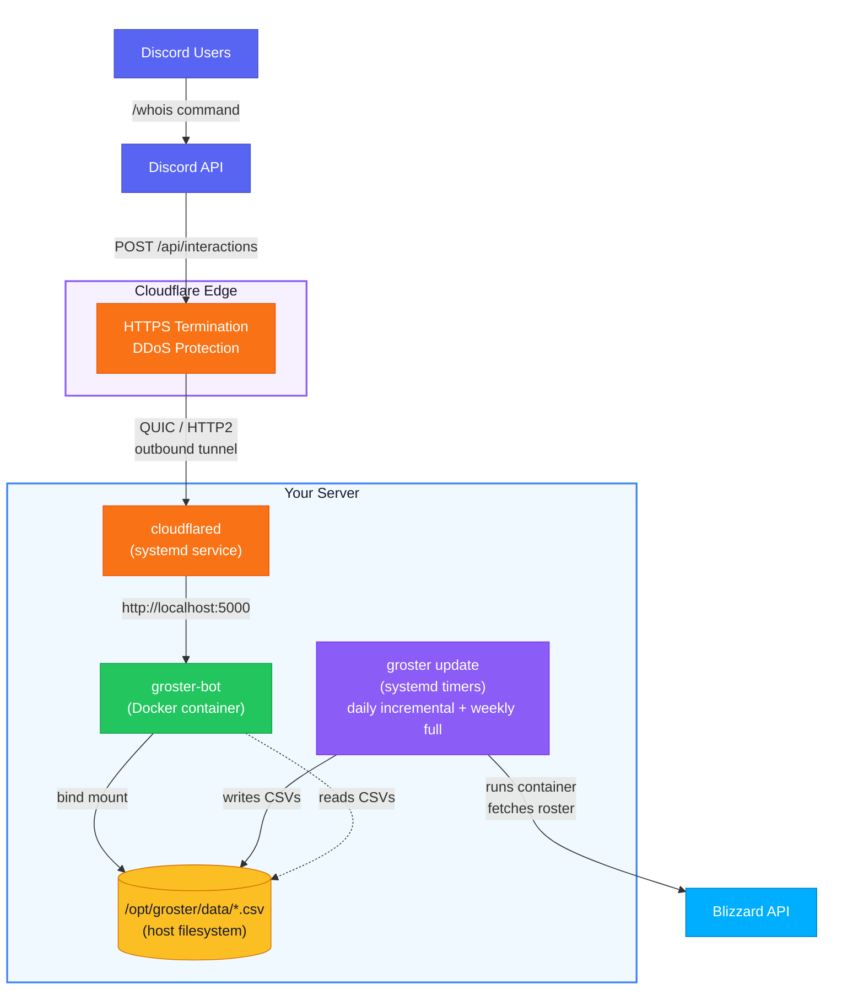

# Deploying groster on a Local Server

## Overview

Running a Discord bot on a home server creates a practical challenge: Discord needs a public HTTPS endpoint to deliver interaction events, but exposing your home network directly to the internet introduces unnecessary risk. Traditional approaches force a choice between convenience (open ports, dynamic DNS) and security (VPN complexity, firewall maintenance). This guide eliminates that tradeoff.

The architecture here combines Docker on a local Linux server with Cloudflare Tunnel, creating a deployment where your server has _zero open inbound ports_. No web port exposed to scanners. No dynamic DNS to maintain. Traffic reaches your bot only through an encrypted tunnel that Cloudflare's network initiates from your server outward. This inverts the typical security model: instead of defending an exposed surface, you create an invisible one.

Why Cloudflare Tunnel instead of port forwarding? Port forwarding exposes your home IP, requires router configuration that breaks on ISP changes, and leaves a permanent attack surface. Cloudflare Tunnel creates an outbound-only connection from your server to Cloudflare's edge. Your server initiates the tunnel; nothing on the internet can reach it directly. The result: Discord sends interaction events to Cloudflare, which routes them through the tunnel to your bot. No ports to open, no IP addresses to manage.

This setup costs nothing beyond what you already have. Cloudflare's tunnel and DNS proxy features are free for personal use. A domain costs a few dollars per year. Docker is free. For that price, you get a production-grade deployment with enterprise-level network security.

## Prerequisites

Before starting, gather these:

- A Linux server (Ubuntu, Debian, Fedora, Gentoo, or similar) with systemd, running on your local network
- A domain added to Cloudflare (free plan) with nameservers pointed to Cloudflare
- SSH access to the server from your workstation
- Blizzard Battle.net API credentials (Client ID + Secret) from [develop.battle.net](https://develop.battle.net/)
- Discord application with bot token, public key, and application ID from the [Discord Developer Portal](https://discord.com/developers/applications)

## How it works

The deployment proceeds through ten steps: Docker installation, tunnel setup, project preparation, environment configuration, Docker Compose override, build and launch, Discord endpoint registration, and scheduled roster updates. Each step builds on the previous, so you'll have a working deployment before adding automation layers.



What auto-restarts:

- **Docker daemon** - systemd `docker.service`, enabled
- **groster-bot container** - `restart: always` in compose
- **cloudflared** - systemd service, enabled, auto-reconnects
- **Roster update** - two systemd timers: daily incremental at 04:00, weekly full refresh (`--force`) on Sundays at 05:00. Both use `Persistent=true` to catch up after downtime

What doesn't change:

- **Your domain URL** - CNAME points to the named tunnel UUID, which is permanent
- **Discord endpoint** - set once in the Developer Portal, never needs updating

---

## Step 1: Install Docker

Install Docker Engine, Docker Compose, and the BuildKit plugin. The exact commands depend on your distribution.

**Ubuntu / Debian:**

```bash
curl -fsSL https://get.docker.com | sh
```

**Fedora:**

```bash
sudo dnf install docker-ce docker-ce-cli containerd.io docker-buildx-plugin docker-compose-plugin
```

**Gentoo:**

```bash
sudo emerge --ask app-containers/docker app-containers/docker-compose app-containers/docker-buildx
```

If emerge reports missing kernel options, enable them in your kernel config, rebuild, and reboot. The emerge output will list exactly which `CONFIG_*` flags are needed. Typical ones include `CONFIG_CGROUPS`, `CONFIG_NAMESPACES`, `CONFIG_VETH`, `CONFIG_BRIDGE`, `CONFIG_NETFILTER_XT_*`, `CONFIG_OVERLAY_FS`.

For other distributions, follow the [official Docker installation guide](https://docs.docker.com/engine/install/).

Enable and start Docker:

```bash
sudo systemctl enable docker.service
sudo systemctl start docker.service
```

Add your user to the `docker` group so you can run commands without sudo:

```bash
sudo usermod -aG docker $USER
```

Log out and back in (or `newgrp docker`) for the group change to take effect.

Verify:

```bash
docker info
docker compose version
```

---

## Step 2: Install cloudflared

Install the `cloudflared` daemon. Choose the method that matches your distribution.

**Ubuntu / Debian (apt):**

```bash
curl -fsSL https://pkg.cloudflare.com/cloudflare-main.gpg \
  | sudo tee /usr/share/keyrings/cloudflare-main.gpg >/dev/null

echo "deb [signed-by=/usr/share/keyrings/cloudflare-main.gpg] \
  https://pkg.cloudflare.com/cloudflared $(lsb_release -cs) main" \
  | sudo tee /etc/apt/sources.list.d/cloudflared.list

sudo apt update && sudo apt install cloudflared -y
```

**Fedora / RHEL (rpm):**

```bash
sudo yum install -y \
  https://github.com/cloudflare/cloudflared/releases/latest/download/cloudflared-linux-x86_64.rpm
```

**Gentoo / Static binary (any distribution):**

Gentoo doesn't have a native package for `cloudflared`. Install the static binary from GitHub:

```bash
wget https://github.com/cloudflare/cloudflared/releases/latest/download/cloudflared-linux-amd64 \
  -O /tmp/cloudflared
sudo install -m 0755 /tmp/cloudflared /usr/local/bin/cloudflared
```

Verify:

```bash
cloudflared --version
```

To update later, repeat the same installation command for your method.

---

## Step 3: Create a named Cloudflare Tunnel

A named tunnel gives you a stable UUID and a permanent CNAME record - the URL never changes, even if you restart cloudflared or reboot.

### 3.1 Authenticate cloudflared

```bash
cloudflared tunnel login
```

This opens a browser URL. Log in to your Cloudflare account and authorize the domain you want to use. A `cert.pem` file is saved to `~/.cloudflared/`.

### 3.2 Create the tunnel

```bash
cloudflared tunnel create groster
```

Output:

```
Tunnel credentials written to /home/<user>/.cloudflared/<UUID>.json
Created tunnel groster with id <UUID>
```

Note the UUID - you'll need it in several places.

### 3.3 Move credentials to /etc/cloudflared

Keep everything in one place so the systemd service doesn't depend on your home directory. When you run `sudo cloudflared service install`, the `$HOME` variable points to `/root`, not your user's home directory. Placing config and credentials in `/etc/cloudflared/` follows the Filesystem Hierarchy Standard and avoids this path confusion.

```bash
sudo mkdir -p /etc/cloudflared
sudo cp ~/.cloudflared/<UUID>.json /etc/cloudflared/
sudo chmod 600 /etc/cloudflared/<UUID>.json
```

### 3.4 Create the config file

Create `/etc/cloudflared/config.yml`:

```yaml
tunnel: <UUID>
credentials-file: /etc/cloudflared/<UUID>.json

ingress:
  - hostname: groster.yourdomain.com
    service: http://localhost:5000
  - service: http_status:404
```

Replace `<UUID>` with your actual tunnel UUID. This must be the real UUID string (e.g. `a1b2c3d4-e5f6-...`), not the literal text `<UUID>` - both in `tunnel:` and in the `credentials-file:` path. Replace `groster.yourdomain.com` with the hostname you want to use.

The `ingress` block tells cloudflared: requests to your hostname go to the local bot on port 5000; everything else gets a 404.

### 3.5 Create the DNS record

```bash
cloudflared tunnel route dns groster groster.yourdomain.com
```

This creates a CNAME record in Cloudflare DNS pointing `groster.yourdomain.com` to `<UUID>.cfargotunnel.com`. The URL is now permanent.

### 3.6 Install cloudflared as a systemd service

```bash
sudo cloudflared --config /etc/cloudflared/config.yml service install
sudo systemctl enable cloudflared
sudo systemctl start cloudflared
```

Verify:

```bash
sudo systemctl status cloudflared
cloudflared tunnel info groster
```

If the service fails to start, check the journal for the actual error:

```bash
journalctl -u cloudflared.service --no-pager -n 30
```

The most common cause is a mismatch between the UUID in `config.yml` and the actual credentials filename in `/etc/cloudflared/`.

The tunnel is now running, auto-starts on boot, and will reconnect on network interruptions.

### 3.7 Verify the tunnel is proxying

```bash
curl -s -o /dev/null -w "%{http_code}" https://groster.yourdomain.com/api/interactions
```

Expected: `405` (Method Not Allowed) - the request reached the bot through Cloudflare, but curl sends GET while the endpoint only accepts POST. This confirms the full chain works: Cloudflare edge -> cloudflared -> localhost:5000.

If you haven't started the bot yet (Steps 7-8), skip this check and return to it after the bot is running.

---

## Step 4: Prepare the project directory

Create the directory as root, then hand ownership to your user. Everything after this runs as your regular user (no sudo needed for git, docker compose, etc.):

```bash
sudo mkdir -p /opt/groster
sudo chown $(whoami):$(whoami) /opt/groster

cd /opt/groster
git clone https://github.com/sergeyklay/groster.git .
mkdir -p data
```

If you already have a checkout, pull instead:

```bash
cd /opt/groster
git pull origin main
mkdir -p data
```

---

## Step 5: Transfer existing data (optional)

> This step is only needed if you have existing roster data (CSV files) from a previous groster installation on another machine.

Copy the data directory from your existing machine to the server. Use `scp`, `rsync`, or any file transfer method available to you.

**From the existing machine** (push to server):

```bash
scp -r /path/to/groster/data/* user@server:/opt/groster/data/
```

**From the server** (pull from existing machine):

```bash
scp -r user@source-machine:/path/to/groster/data/* /opt/groster/data/
```

Replace `user`, `server`, `source-machine`, and paths with your actual values.

Verify the CSVs landed:

```bash
ls -la /opt/groster/data/
```

You should see files like `*-dashboard.csv`, `classes.csv`, `races.csv`, etc.

> **Note on file permissions:** The container's `groster` user runs as UID 1000 (see Dockerfile). If your host user is also UID 1000 (the default for the first user on most Linux distributions), file permissions work without any extra configuration. If your UID differs, adjust ownership:
>
> ```bash
> sudo chown -R 1000:1000 /opt/groster/data/
> ```

If you don't have existing data, skip this step entirely. The daily roster update (Step 10) will generate the CSV files automatically on its first run.

---

## Step 6: Configure environment

```bash
cp .env.example .env
```

Edit `/opt/groster/.env`:

```ini
BLIZZARD_CLIENT_ID="your-blizzard-client-id"
BLIZZARD_CLIENT_SECRET="your-blizzard-client-secret"

DISCORD_APP_ID="your-discord-application-id"
DISCORD_PUBLIC_KEY="your-discord-public-key"
DISCORD_BOT_TOKEN="your-discord-bot-token"
DISCORD_GUILD_ID="your-discord-server-id"

WOW_REGION="eu"
WOW_REALM="your-realm"
WOW_GUILD="your-guild-name"
```

Replace all placeholder values with your actual credentials and guild information. The `WOW_REALM` and `WOW_GUILD` values should be URL-slugified (lowercase, hyphens instead of spaces).

Protect the file:

```bash
chmod 600 /opt/groster/.env
```

---

## Step 7: Override compose.yaml for production

The repo's `compose.yaml` uses a Docker volume (`groster-data`). For a local server deployment, you want a host bind mount instead, so the CSVs live on the host filesystem where they're accessible to backups and the scheduled update job.

Create `/opt/groster/compose.override.yaml`:

```yaml
services:
  bot:
    restart: always
    ports: []
    network_mode: host
    volumes:
      - /opt/groster/data:/app/data
    logging:
      driver: json-file
      options:
        max-size: "20m"
        max-file: "5"
        tag: "groster-bot"
```

What this does:

- **`restart: always`** - overrides `unless-stopped` so the container always restarts, including after a full reboot.
- **`ports: []` + `network_mode: host`** - the bot listens on `localhost:5000` directly, which is what the cloudflared config points to. No port mapping needed.
- **`volumes: /opt/groster/data:/app/data`** - bind mount replaces the Docker volume. Your CSVs are used directly from the host filesystem.
- **`logging: json-file`** - Docker logs are JSON with rotation (20 MB per file, 5 files max). Combined with `GROSTER_LOG_FORMAT=json` already set in the base compose, you get structured JSON logging all the way through.

---

## Step 8: Build and start

```bash
cd /opt/groster
docker compose -f compose.yaml -f compose.override.yaml build
docker compose -f compose.yaml -f compose.override.yaml up -d
```

You may see a warning: `Published ports are discarded when using host network mode`. This is harmless - the base `compose.yaml` declares ports, but `network_mode: host` in the override makes port mapping irrelevant. The bot listens on `localhost:5000` directly.

Check:

```bash
docker compose -f compose.yaml -f compose.override.yaml ps
docker compose -f compose.yaml -f compose.override.yaml logs --tail=20
```

The `groster-bot` container should be `Up (healthy)` and logs should be JSON.

Tip: to avoid typing `-f` flags every time, add a shell alias:

```bash
# ~/.bashrc or ~/.zshrc
alias groster-compose='docker compose -f /opt/groster/compose.yaml -f /opt/groster/compose.override.yaml'
```

Then: `groster-compose ps`, `groster-compose logs`, etc.

---

## Step 9: Configure Discord endpoint URL

Go to the [Discord Developer Portal](https://discord.com/developers/applications), select your application, and set the **Interactions Endpoint URL** to:

```
https://groster.yourdomain.com/api/interactions
```

Replace `groster.yourdomain.com` with the hostname you configured in Step 3.

Click Save. Discord sends a PING to verify - the bot must be running and cloudflared must be active. If it fails, check `docker compose logs` and `systemctl status cloudflared`.

### Slash command registration

The `/whois` command is registered with Discord's API per guild, not per server. If you already ran `groster register` from another machine for the same `DISCORD_APP_ID` and `DISCORD_GUILD_ID`, the command is already registered - skip this.

Only run this if it's a fresh Discord application or you changed the command definition:

```bash
cd /opt/groster
docker compose -f compose.yaml -f compose.override.yaml run --rm bot register
```

---

## Step 10: Set up scheduled roster updates

The bot needs fresh roster data from the Blizzard API. Two systemd timers handle this: a daily incremental update that only fetches new or changed members, and a weekly full refresh that re-fetches everything.

Why two timers? Incremental updates are fast and cheap - they diff the current guild roster against the previous snapshot and only call the API for members whose rank or level changed. A 500-member guild with 5% daily churn makes ~200 API calls instead of ~2000. The weekly full refresh (`--force`) ensures nothing drifts: it re-fetches all profiles, achievements, pets, and mounts regardless of what changed.

### Create the service units

The daily incremental update:

```bash
sudo tee /etc/systemd/system/groster-update.service << 'EOF'
[Unit]
Description=Groster incremental roster update
Requires=docker.service
After=docker.service

[Service]
Type=oneshot
WorkingDirectory=/opt/groster
ExecStart=/usr/bin/docker compose -f compose.yaml -f compose.override.yaml run --rm -e GROSTER_LOG_FORMAT=json bot update
EOF
```

The weekly full refresh:

```bash
sudo tee /etc/systemd/system/groster-update-full.service << 'EOF'
[Unit]
Description=Groster full roster update (force refresh)
Requires=docker.service
After=docker.service

[Service]
Type=oneshot
WorkingDirectory=/opt/groster
ExecStart=/usr/bin/docker compose -f compose.yaml -f compose.override.yaml run --rm -e GROSTER_LOG_FORMAT=json bot update --force
EOF
```

Both are one-shot jobs: spin up a temporary container, run the update, write CSVs to `/opt/groster/data`, and exit. The only difference is `--force`, which bypasses all cached data and re-fetches every member from scratch.

### Create the timer units

Daily incremental at 04:00:

```bash
sudo tee /etc/systemd/system/groster-update.timer << 'EOF'
[Unit]
Description=Daily groster incremental roster update

[Timer]
OnCalendar=*-*-* 04:00:00
Persistent=true

[Install]
WantedBy=timers.target
EOF
```

Weekly full refresh on Sundays at 05:00:

```bash
sudo tee /etc/systemd/system/groster-update-full.timer << 'EOF'
[Unit]
Description=Weekly groster full roster update

[Timer]
OnCalendar=Sun *-*-* 05:00:00
Persistent=true

[Install]
WantedBy=timers.target
EOF
```

`Persistent=true` means if the server was off at the scheduled time, the job runs at next boot. The one-hour gap between the timers avoids overlap if the server reboots and both catch up.

### Enable the timers

```bash
sudo systemctl daemon-reload
sudo systemctl enable --now groster-update.timer
sudo systemctl enable --now groster-update-full.timer
```

### Verify

```bash
systemctl list-timers | grep groster
```

You should see two timers listed: one firing daily, one firing weekly.

### Manual run

To trigger an incremental update immediately:

```bash
sudo systemctl start groster-update.service
journalctl -u groster-update.service --no-pager -n 50
```

To trigger a full refresh:

```bash
sudo systemctl start groster-update-full.service
journalctl -u groster-update-full.service --no-pager -n 50
```

---

## Verification checklist

After everything is set up, verify each layer:

```bash
# 1. cloudflared tunnel is running and connected
sudo systemctl status cloudflared
cloudflared tunnel info groster

# 2. Docker is running, container is healthy
docker compose -f /opt/groster/compose.yaml -f /opt/groster/compose.override.yaml ps

# 3. Bot responds to health check
python3 -c "import socket; s=socket.create_connection(('localhost',5000),2); s.close(); print('OK')"

# 4. Logs are structured JSON
docker compose -f /opt/groster/compose.yaml -f /opt/groster/compose.override.yaml logs --tail=5

# 5. Data directory has CSVs (after first update run)
ls -la /opt/groster/data/*.csv

# 6. Timers are scheduled
systemctl list-timers | grep groster

# 7. Test from Discord
#    Type /whois player:SomeCharacterName in your Discord server
```

---

## Maintenance

### View logs

```bash
# Bot logs (JSON, from Docker)
docker logs groster-bot --tail=100

# Roster update logs (daily incremental)
journalctl -u groster-update.service --since "1 hour ago"

# Full refresh logs (weekly)
journalctl -u groster-update-full.service --since "1 hour ago"

# Cloudflared logs
journalctl -u cloudflared --since "1 hour ago"
```

### Manual roster update

Incremental (only new/changed members):

```bash
cd /opt/groster
docker compose -f compose.yaml -f compose.override.yaml run --rm bot update
```

Full refresh (re-fetch everything):

```bash
cd /opt/groster
docker compose -f compose.yaml -f compose.override.yaml run --rm bot update --force
```

### Rebuild after code changes

```bash
cd /opt/groster
git pull
docker compose -f compose.yaml -f compose.override.yaml build
docker compose -f compose.yaml -f compose.override.yaml up -d
```

### Update cloudflared

Repeat the installation command for your method. For example, with the static binary:

```bash
wget https://github.com/cloudflare/cloudflared/releases/latest/download/cloudflared-linux-amd64 \
  -O /tmp/cloudflared
sudo install -m 0755 /tmp/cloudflared /usr/local/bin/cloudflared
sudo systemctl restart cloudflared
cloudflared --version
```

If you installed via apt or yum, a standard `apt upgrade` or `yum update` handles it.

### Backup data

```bash
tar czf /tmp/groster-data-$(date +%Y%m%d).tar.gz -C /opt/groster/data .
```

### Disaster recovery

If the container won't start:

```bash
# Check logs
docker compose -f compose.yaml -f compose.override.yaml logs --tail=200

# Rebuild from scratch
docker compose -f compose.yaml -f compose.override.yaml down
docker compose -f compose.yaml -f compose.override.yaml build --no-cache
docker compose -f compose.yaml -f compose.override.yaml up -d
```

If cloudflared loses connection, it reconnects automatically. If the tunnel is deleted by accident, you need to create a new one (repeat Step 3) and update the Discord endpoint URL.

## Troubleshooting

### Tunnel not connecting

Check the service status and logs:

```bash
sudo systemctl status cloudflared
journalctl -u cloudflared.service --no-pager -n 30
```

Common causes: incorrect UUID in config file, missing credentials file, DNS record pointing to wrong tunnel.

### Bot not reachable through tunnel

Verify the bot runs locally:

```bash
docker compose -f compose.yaml -f compose.override.yaml ps
python3 -c "import socket; s=socket.create_connection(('localhost',5000),2); s.close(); print('OK')"
```

If the health check fails, check Docker logs with `docker compose -f compose.yaml -f compose.override.yaml logs`.

### Discord endpoint verification fails

Three things to verify:

1. The bot container is running and healthy (`docker compose ps`)
2. cloudflared is active (`systemctl status cloudflared`)
3. The hostname in the Discord Developer Portal matches the hostname in `/etc/cloudflared/config.yml` exactly

### Roster update fails

```bash
journalctl -u groster-update.service --no-pager -n 50
```

Common causes: expired Blizzard API credentials, network issues, or the Docker image needs rebuilding after a code update.

### Tunnel credential backup

The tunnel credentials file (`<UUID>.json` in `/etc/cloudflared/`) is your tunnel's identity. If you lose it and the server dies, you'll need to create a new tunnel and update DNS. Consider backing this file up alongside your data backups.
