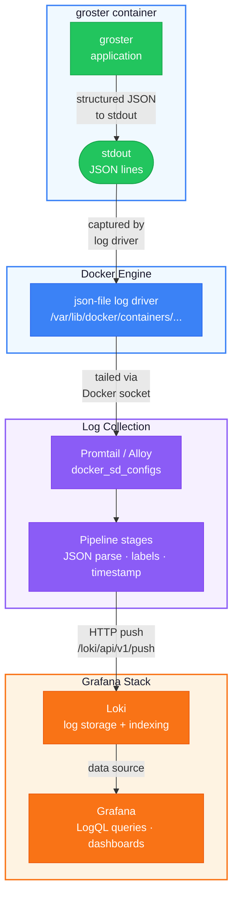

# Sending groster Logs to Grafana via Loki

## Overview

groster already outputs structured JSON logs when running in Docker (`GROSTER_LOG_FORMAT=json`). Each log line contains machine-parseable fields — `timestamp`, `level`, `logger`, `message`, `service`, `version`, and more. The missing piece is a pipeline that collects these logs from the Docker container and delivers them to Loki, where Grafana can query and visualize them.

The standard path for this is: Docker writes container logs to files on the host → Promtail (or Grafana Alloy) watches those files → parses the JSON → pushes to Loki → Grafana queries Loki. This guide walks through the Promtail path, which is lighter and more common for single-server setups. If you already run Grafana Alloy, the configuration is nearly identical — the pipeline stages are the same, only the config syntax differs.

What you get at the end: a "groster" label in Grafana's Explore view, fully parsed log fields, level-based filtering, and a pre-built dashboard for monitoring the bot and roster updates.

## Prerequisites

- groster deployed with Docker Compose (as described in [deploy-local-server.md](deploy-local-server.md))
- Grafana, Prometheus, and Loki already running on the same server (or reachable from it)
- Promtail installed (or Grafana Alloy — see the Alloy section at the end)
- The groster container outputs JSON logs (verify with `docker logs groster-bot --tail=5` — you should see single-line JSON objects)

## How it works



Docker wraps each stdout line in its own JSON envelope (`{"log": "...", "stream": "stdout", "time": "..."}`), so there are two layers of JSON. Promtail handles this automatically — it extracts the `log` field from Docker's envelope, then your pipeline stages parse groster's JSON from within that.

---

## Step 1: Verify groster log output

Before configuring Promtail, confirm the logs are in the expected format.

```bash
docker logs groster-bot --tail=3
```

Expected output — each line is a single JSON object:

```json
{
  "timestamp": "2026-03-12T14:23:45.123Z",
  "level": "INFO",
  "logger": "groster.commands.bot",
  "message": "Starting bot server on 0.0.0.0:5000",
  "module": "bot",
  "function": "_create_app",
  "line": 42,
  "service": "groster",
  "version": "0.5.0"
}
```

If you see text-formatted logs (`[2026-03-12 14:23:45] [INFO] - Starting bot server...`), the `GROSTER_LOG_FORMAT` environment variable is not set to `json`. Check your `compose.yaml` or `compose.override.yaml`:

```bash
docker compose -f compose.yaml -f compose.override.yaml exec bot env | grep GROSTER_LOG_FORMAT
```

It must be `GROSTER_LOG_FORMAT=json`. If it's missing or set to `text`, add it to the `environment:` section of your compose file and recreate the container:

```bash
docker compose -f compose.yaml -f compose.override.yaml up -d
```

Also verify that Docker's log driver is `json-file` (the default) and that log rotation is configured:

```bash
docker inspect groster-bot --format='{{.HostConfig.LogConfig.Type}}'
```

Expected: `json-file`. The `compose.yaml` already configures rotation (`max-size: 10m`, `max-file: 3`), preventing unbounded disk growth.

---

## Step 2: Install Promtail

Promtail is the log collection agent built specifically for Loki. It tails log files, applies pipeline stages, and pushes to Loki's API.

**Ubuntu / Debian:**

```bash
sudo apt install -y apt-transport-https software-properties-common

sudo mkdir -p /etc/apt/keyrings/
wget -q -O - https://apt.grafana.com/gpg.key | gpg --dearmor | sudo tee /etc/apt/keyrings/grafana.gpg > /dev/null

echo "deb [signed-by=/etc/apt/keyrings/grafana.gpg] https://apt.grafana.com stable main" | \
  sudo tee /etc/apt/sources.list.d/grafana.list

sudo apt update
sudo apt install -y promtail
```

**Fedora / RHEL:**

```bash
sudo dnf install -y promtail
```

If the Grafana repo isn't configured, add it first:

```bash
sudo tee /etc/yum.repos.d/grafana.repo << 'EOF'
[grafana]
name=grafana
baseurl=https://rpm.grafana.com
repo_gpgcheck=1
enabled=1
gpgcheck=1
gpgkey=https://rpm.grafana.com/gpg.key
sslverify=1
sslcacert=/etc/pki/tls/certs/ca-bundle.crt
EOF
sudo dnf install -y promtail
```

**Gentoo / Static binary:**

```bash
# Check latest version at https://github.com/grafana/loki/releases
PROMTAIL_VERSION="3.4.2"
wget "https://github.com/grafana/loki/releases/download/v${PROMTAIL_VERSION}/promtail-linux-amd64.zip" \
  -O /tmp/promtail.zip
unzip /tmp/promtail.zip -d /tmp/
sudo install -m 0755 /tmp/promtail-linux-amd64 /usr/local/bin/promtail
```

For the static binary, you'll also need to create the systemd service manually (see Step 4).

Verify:

```bash
promtail --version
```

---

## Step 3: Configure Promtail for groster

Promtail needs permission to read Docker container logs and access the Docker socket for container discovery. The default `promtail` user won't have this access.

### 3.1 Grant Docker socket access

Add the `promtail` user to the `docker` group:

```bash
sudo usermod -aG docker promtail
```

If Promtail runs as a different user (check with `ps aux | grep promtail`), add that user instead.

### 3.2 Create the Promtail config

Create or edit `/etc/promtail/config.yml`:

```yaml
server:
  http_listen_port: 9080
  grpc_listen_port: 0

positions:
  filename: /tmp/positions.yaml

clients:
  - url: http://localhost:3100/loki/api/v1/push

scrape_configs:
  # ---------------------------------------------------------------
  # groster: structured JSON logs from the Docker container
  # ---------------------------------------------------------------
  - job_name: groster
    docker_sd_configs:
      - host: unix:///var/run/docker.sock
        refresh_interval: 30s
        filters:
          - name: name
            values: ["groster-bot"]

    relabel_configs:
      # Use container name as the instance label
      - source_labels: ["__meta_docker_container_name"]
        regex: "/(.*)"
        target_label: "container"

      # Static labels for all groster logs
      - target_label: "job"
        replacement: "groster"

    pipeline_stages:
      # Step 1: Parse groster's JSON from the log line
      - json:
          expressions:
            level: level
            logger: logger
            service: service
            version: version
            timestamp: timestamp
            message: message
            module: module
            function: function
            line: line

      # Step 2: Promote low-cardinality fields to Loki labels
      # Only level, service, and version — these have bounded value sets.
      # High-cardinality fields (logger, function, module, line) stay
      # in the log line and are queried with LogQL filters.
      - labels:
          level:
          service:
          version:

      # Step 3: Use groster's timestamp (UTC, microsecond precision)
      # instead of Docker's ingestion timestamp
      - timestamp:
          source: timestamp
          format: "2006-01-02T15:04:05.000Z"
          location: UTC

      # Step 4: Replace the log line with the original message
      # for cleaner display in Grafana. The JSON fields are still
      # available via label filters and LogQL json parser.
      - output:
          source: message
```

**Key design decisions:**

- **`docker_sd_configs`** discovers the container automatically by name (`groster-bot`). No need to hardcode log file paths — Promtail finds the right file via the Docker socket.
- **`filters: name: groster-bot`** limits scraping to only the groster container. If you run `docker compose run --rm bot update`, that ephemeral container has a different name (e.g., `groster-bot-run-abc123`). To capture update job logs too, change the filter to use a label match instead:

  ```yaml
  filters:
    - name: label
      values: ["com.docker.compose.service=bot"]
  ```

  This matches any container from the `bot` service in the groster compose project, regardless of the container name.

- **Label cardinality**: Only `level` (5 values), `service` (1 value), and `version` (changes on deploys) are promoted to Loki labels. Loki performs best with low-cardinality labels. Fields like `logger`, `function`, and `line` change per log entry — keeping them as structured data inside the log line avoids index bloat.
- **`output: source: message`** replaces the full JSON blob with just the human-readable message in Grafana's log view. When you need the other fields, use `| json` in your LogQL query to re-parse them on the fly.

### 3.3 Validate the config

```bash
promtail --config.file=/etc/promtail/config.yml --dry-run
```

If the command exits without errors, the config is valid. If you see YAML parsing errors, check indentation — YAML is whitespace-sensitive.

---

## Step 4: Start Promtail

**If installed via package manager** (systemd service already exists):

```bash
sudo systemctl enable promtail
sudo systemctl restart promtail
```

**If installed via static binary**, create the systemd unit:

```bash
sudo tee /etc/systemd/system/promtail.service << 'EOF'
[Unit]
Description=Promtail log collector for Loki
After=network.target docker.service

[Service]
Type=simple
User=promtail
ExecStart=/usr/local/bin/promtail --config.file=/etc/promtail/config.yml
Restart=on-failure
RestartSec=5

[Install]
WantedBy=multi-user.target
EOF

sudo systemctl daemon-reload
sudo systemctl enable --now promtail
```

Check that it's running and connected to Loki:

```bash
sudo systemctl status promtail
journalctl -u promtail --no-pager -n 20
```

Look for a line like `msg="Reading from client" client=<container-id>` — this confirms Promtail found the groster container and is tailing its logs.

If you see permission errors for `/var/run/docker.sock`, the `promtail` user isn't in the `docker` group. Re-check Step 3.1 and restart the service.

---

## Step 5: Verify logs in Loki

Before opening Grafana, verify that Loki is receiving the logs:

```bash
# Query Loki directly for groster logs from the last hour
curl -s "http://localhost:3100/loki/api/v1/query_range" \
  --data-urlencode 'query={job="groster"}' \
  --data-urlencode 'limit=5' | python3 -m json.tool
```

You should see a JSON response with `result` containing log entries. If the result is empty:

1. Check Promtail targets: `curl -s http://localhost:9080/targets | python3 -m json.tool` — look for a target with state `Ready` and the groster container label.
2. Check that the groster container is running: `docker ps | grep groster-bot`
3. Check Promtail logs: `journalctl -u promtail --since "5 min ago"`
4. Check Loki logs: `journalctl -u loki --since "5 min ago"`

---

## Step 6: Configure Grafana data source

If Loki is already added as a data source in Grafana, skip to Step 7.

1. Open Grafana in your browser (typically `http://localhost:3000`)
2. Go to **Connections → Data sources → Add data source**
3. Select **Loki**
4. Set the URL to `http://localhost:3100` (or wherever Loki listens)
5. Click **Save & test** — you should see "Data source successfully connected"

---

## Step 7: Query groster logs in Grafana Explore

Open **Explore** in Grafana, select the Loki data source, and run these LogQL queries:

### All groster logs

```logql
{job="groster"}
```

### Filter by log level

```logql
{job="groster", level="ERROR"}
```

```logql
{job="groster", level=~"ERROR|WARNING"}
```

### Search by message content

```logql
{job="groster"} |= "roster"
```

### Parse JSON fields on the fly

When you need access to fields that aren't Loki labels (like `logger`, `function`, `module`), use the `json` parser:

```logql
{job="groster"} | json | logger="groster.services"
```

```logql
{job="groster"} | json | function="identify_alts"
```

```logql
{job="groster"} | json | module="http_client" | level="ERROR"
```

### Count errors over time

```logql
count_over_time({job="groster", level="ERROR"}[5m])
```

### Log throughput by level

```logql
sum by (level) (rate({job="groster"}[5m]))
```

### Logs from roster update jobs

If you configured the Compose service label filter (see Step 3.2), update jobs use the same `{job="groster"}` selector. Filter by message content to isolate them:

```logql
{job="groster"} |= "Fetching roster"
```

Or by the function that runs the update:

```logql
{job="groster"} | json | function="update_roster"
```

---

## Step 8: Create a Grafana dashboard (optional)

A dashboard gives you a persistent, at-a-glance view of groster's health without writing queries manually.

### 8.1 Import via JSON

Save the following JSON to a file (e.g., `/tmp/groster-dashboard.json`) and import it in Grafana via **Dashboards → Import → Upload dashboard JSON file**:

```json
{
  "dashboard": {
    "title": "groster",
    "tags": ["groster", "loki"],
    "timezone": "utc",
    "refresh": "30s",
    "time": {
      "from": "now-24h",
      "to": "now"
    },
    "panels": [
      {
        "title": "Log volume by level",
        "type": "timeseries",
        "gridPos": { "h": 8, "w": 16, "x": 0, "y": 0 },
        "targets": [
          {
            "expr": "sum by (level) (rate({job=\"groster\"} [5m]))",
            "legendFormat": "{{level}}"
          }
        ],
        "fieldConfig": {
          "defaults": {
            "custom": {
              "drawStyle": "bars",
              "stacking": { "mode": "normal" }
            }
          },
          "overrides": [
            {
              "matcher": { "id": "byName", "options": "ERROR" },
              "properties": [
                {
                  "id": "color",
                  "value": { "fixedColor": "red", "mode": "fixed" }
                }
              ]
            },
            {
              "matcher": { "id": "byName", "options": "WARNING" },
              "properties": [
                {
                  "id": "color",
                  "value": { "fixedColor": "orange", "mode": "fixed" }
                }
              ]
            },
            {
              "matcher": { "id": "byName", "options": "INFO" },
              "properties": [
                {
                  "id": "color",
                  "value": { "fixedColor": "green", "mode": "fixed" }
                }
              ]
            },
            {
              "matcher": { "id": "byName", "options": "DEBUG" },
              "properties": [
                {
                  "id": "color",
                  "value": { "fixedColor": "blue", "mode": "fixed" }
                }
              ]
            }
          ]
        }
      },
      {
        "title": "Top 10 users",
        "description": "Discord users who invoked /whois or /ping commands, ranked by query count.",
        "type": "table",
        "gridPos": { "h": 8, "w": 4, "x": 16, "y": 0 },
        "targets": [
          {
            "expr": "topk(10, sum by (user) (count_over_time({job=\"groster\"} |= \"Invoking user\" | pattern \"Invoking user: <user> (<_>)\" [$__range])))",
            "instant": true,
            "refId": "A"
          }
        ],
        "transformations": [
          { "id": "labelsToFields", "options": { "mode": "columns" } },
          {
            "id": "organize",
            "options": {
              "excludeByName": {
                "Time": true,
                "container": true,
                "detected_level": true,
                "job": true,
                "level": true,
                "service": true,
                "service_name": true,
                "version": true
              },
              "renameByName": { "Value": "Queries", "user": "User" },
              "indexByName": { "user": 0, "Value": 1 }
            }
          },
          {
            "id": "sortBy",
            "options": { "sort": [{ "field": "Queries", "desc": true }] }
          }
        ],
        "fieldConfig": { "defaults": {}, "overrides": [] },
        "options": { "showHeader": true, "footer": { "show": false } }
      },
      {
        "title": "Top 10 searched characters",
        "description": "WoW characters looked up via /whois, ranked by lookup count.",
        "type": "table",
        "gridPos": { "h": 8, "w": 4, "x": 20, "y": 0 },
        "targets": [
          {
            "expr": "topk(10, sum by (character) (count_over_time({job=\"groster\"} |= \"Received character name\" | pattern \"Received character name: <character>\" [$__range])))",
            "instant": true,
            "refId": "A"
          }
        ],
        "transformations": [
          { "id": "labelsToFields", "options": { "mode": "columns" } },
          {
            "id": "organize",
            "options": {
              "excludeByName": {
                "Time": true,
                "container": true,
                "detected_level": true,
                "job": true,
                "level": true,
                "service": true,
                "service_name": true,
                "version": true
              },
              "renameByName": { "Value": "Lookups", "character": "Character" },
              "indexByName": { "character": 0, "Value": 1 }
            }
          },
          {
            "id": "sortBy",
            "options": { "sort": [{ "field": "Lookups", "desc": true }] }
          }
        ],
        "fieldConfig": { "defaults": {}, "overrides": [] },
        "options": { "showHeader": true, "footer": { "show": false } }
      },
      {
        "title": "Errors",
        "type": "stat",
        "gridPos": { "h": 4, "w": 6, "x": 0, "y": 8 },
        "targets": [
          {
            "expr": "count_over_time({job=\"groster\", level=\"ERROR\"} [$__range])"
          }
        ],
        "fieldConfig": {
          "defaults": {
            "thresholds": {
              "steps": [
                { "color": "green", "value": 0 },
                { "color": "orange", "value": 1 },
                { "color": "red", "value": 5 }
              ]
            }
          }
        }
      },
      {
        "title": "Warnings",
        "type": "stat",
        "gridPos": { "h": 4, "w": 6, "x": 6, "y": 8 },
        "targets": [
          {
            "expr": "count_over_time({job=\"groster\", level=\"WARNING\"} [$__range])"
          }
        ],
        "fieldConfig": {
          "defaults": {
            "thresholds": {
              "steps": [
                { "color": "green", "value": 0 },
                { "color": "orange", "value": 5 },
                { "color": "red", "value": 20 }
              ]
            }
          }
        }
      },
      {
        "title": "Current version",
        "type": "stat",
        "gridPos": { "h": 4, "w": 6, "x": 12, "y": 8 },
        "targets": [
          {
            "expr": "count_over_time({job=\"groster\", version=~\".+\"} [5m])",
            "legendFormat": "{{version}}"
          }
        ],
        "options": {
          "textMode": "name"
        }
      },
      {
        "title": "Container restarts",
        "type": "stat",
        "gridPos": { "h": 4, "w": 6, "x": 18, "y": 8 },
        "targets": [
          {
            "expr": "count_over_time({job=\"groster\", level=\"INFO\"} |= \"Starting bot server\" [$__range])"
          }
        ],
        "fieldConfig": {
          "defaults": {
            "thresholds": {
              "steps": [
                { "color": "green", "value": 0 },
                { "color": "orange", "value": 2 },
                { "color": "red", "value": 5 }
              ]
            },
            "unit": "short",
            "displayName": "Restarts in range"
          }
        }
      },
      {
        "title": "Recent logs",
        "type": "logs",
        "gridPos": { "h": 12, "w": 24, "x": 0, "y": 12 },
        "targets": [
          {
            "expr": "{job=\"groster\"}"
          }
        ],
        "options": {
          "showTime": true,
          "showLabels": true,
          "showCommonLabels": false,
          "wrapLogMessage": true,
          "prettifyLogMessage": false,
          "enableLogDetails": true,
          "sortOrder": "Descending"
        }
      }
    ]
  }
}
```

### 8.2 What the dashboard shows

| Panel                   | Purpose                                                                                                        |
| ----------------------- | -------------------------------------------------------------------------------------------------------------- |
| **Log volume by level** | Stacked bar chart — shows the rate of INFO/WARNING/ERROR logs over time. A spike in red means something broke. |
| **Errors**              | Counter for the selected time range. Green = 0, red = 5+.                                                      |
| **Warnings**            | Same pattern for warnings.                                                                                     |
| **Current version**     | Shows the `version` field from logs — confirms which version is deployed.                                      |
| **Container restarts**  | Counts "Starting bot server" messages — more than 1 in a range suggests crash loops.                           |
| **Recent logs**         | Live log stream with clickable detail expansion.                                                               |

---

## Capturing roster update logs

The daily roster update runs as an ephemeral container (`docker compose run --rm bot update`). By default, this container has a randomly-generated name, so the `name: groster-bot` filter in Promtail won't catch it.

Two options:

### Option A: Use Compose service label (recommended)

Change the Promtail filter from container name to Docker Compose label. In `/etc/promtail/config.yml`, replace:

```yaml
filters:
  - name: name
    values: ["groster-bot"]
```

with:

```yaml
filters:
  - name: label
    values: ["com.docker.compose.service=bot"]
```

This matches all containers from the `bot` service in the groster compose project — both the long-running bot and ephemeral update containers.

After changing, restart Promtail:

```bash
sudo systemctl restart promtail
```

### Option B: Name the update container

If you prefer the name-based filter, give the update container a predictable name in your systemd timer or crontab:

```bash
docker compose -f compose.yaml -f compose.override.yaml run --rm --name groster-update bot update
```

Then add `"groster-update"` to the Promtail filter:

```yaml
filters:
  - name: name
    values: ["groster-bot", "groster-update"]
```

---

## Using Grafana Alloy instead of Promtail

If you run Grafana Alloy (the successor to Promtail, Grafana Agent, and others), the pipeline logic is identical but the syntax is different. Alloy uses River configuration language.

Add this block to your Alloy config (typically `/etc/alloy/config.alloy`):

```hcl
discovery.docker "groster" {
  host = "unix:///var/run/docker.sock"
  filter {
    name   = "label"
    values = ["com.docker.compose.service=bot"]
  }
}

discovery.relabel "groster" {
  targets = discovery.docker.groster.targets

  rule {
    source_labels = ["__meta_docker_container_name"]
    regex         = "/(.*)"
    target_label  = "container"
  }

  rule {
    target_label = "job"
    replacement  = "groster"
  }
}

loki.source.docker "groster" {
  host       = "unix:///var/run/docker.sock"
  targets    = discovery.relabel.groster.output
  forward_to = [loki.process.groster.receiver]
}

loki.process "groster" {
  stage.json {
    expressions = {
      level     = "level",
      logger    = "logger",
      service   = "service",
      version   = "version",
      timestamp = "timestamp",
      message   = "message",
    }
  }

  stage.labels {
    values = {
      level   = "",
      service = "",
      version = "",
    }
  }

  stage.timestamp {
    source = "timestamp"
    format = "2006-01-02T15:04:05.000Z"
  }

  stage.output {
    source = "message"
  }

  forward_to = [loki.write.default.receiver]
}

loki.write "default" {
  endpoint {
    url = "http://localhost:3100/loki/api/v1/push"
  }
}
```

Restart Alloy after adding:

```bash
sudo systemctl restart alloy
```

---

## Troubleshooting

### No logs appearing in Grafana

Work backwards through the pipeline:

1. **Is the container running?**

   ```bash
   docker ps | grep groster-bot
   ```

2. **Is the container producing JSON logs?**

   ```bash
   docker logs groster-bot --tail=3
   ```

3. **Is Promtail running and targeting the container?**

   ```bash
   sudo systemctl status promtail
   curl -s http://localhost:9080/targets
   ```

   Look for a target with `groster-bot` in the labels and state `Ready`.

4. **Is Promtail sending to Loki?**

   ```bash
   journalctl -u promtail --since "5 min ago" | grep -i error
   ```

   Common errors: connection refused (Loki not running), 429 (Loki rate limit).

5. **Is Loki receiving logs?**

   ```bash
   curl -s "http://localhost:3100/loki/api/v1/query_range" \
     --data-urlencode 'query={job="groster"}' \
     --data-urlencode 'limit=1'
   ```

6. **Is Grafana connected to Loki?**
   Go to **Connections → Data sources → Loki → Save & test**.

### Logs appear but fields aren't parsed

The pipeline stages in Step 3.2 extract JSON fields. If they're not working:

- Check that groster outputs valid JSON (not text): `docker logs groster-bot --tail=1 | python3 -m json.tool`
- Check Promtail config syntax: `promtail --config.file=/etc/promtail/config.yml --dry-run`
- In Grafana Explore, run `{job="groster"} | json` — this parses JSON on query time and is a good fallback

### Docker socket permission denied

```
msg="error reading Docker API" err="permission denied"
```

Add the Promtail user to the docker group and restart:

```bash
sudo usermod -aG docker promtail
sudo systemctl restart promtail
```

### Promtail positions file error

```
msg="error creating positions file"
```

The default `/tmp/positions.yaml` may not be writable. Change the path in the config:

```yaml
positions:
  filename: /var/lib/promtail/positions.yaml
```

Create the directory:

```bash
sudo mkdir -p /var/lib/promtail
sudo chown promtail:promtail /var/lib/promtail
```

### High label cardinality warning in Loki

If you accidentally promoted a high-cardinality field (like `logger` or `function`) to a label, Loki's performance degrades. Only `level`, `service`, and `version` should be labels. Remove the offending label from the `labels:` stage in the Promtail config and restart.

Existing high-cardinality data won't be cleaned automatically. You can either wait for retention to expire it or drop the affected streams via the Loki compactor.
